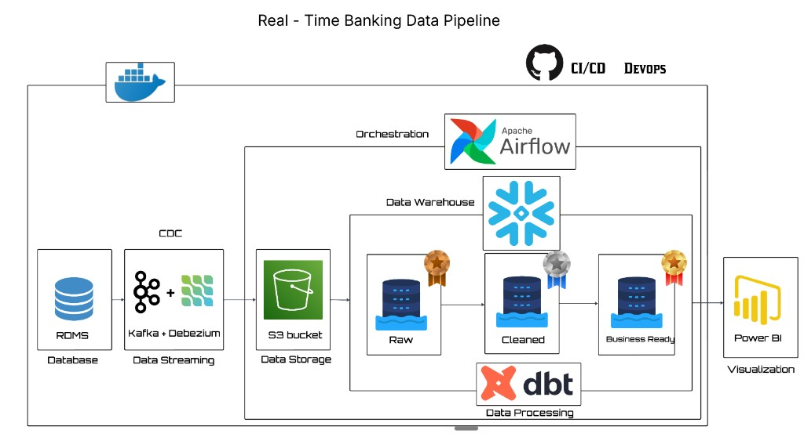

# Real-Time Banking Modern Data Stack


---

## Project Overview

This project is an **end-to-end modern data stack** for a **banking domain**. It simulates customers, accounts, and transactions in PostgreSQL, streams every change in near real time, lands raw data in object storage, loads Snowflake, transforms it with dbt, and prepares analytics-ready marts for BI.

Think of it as a **production-style banking data platform** — CDC ingestion, medallion layering, orchestration, and CI/CD — running locally in Docker.

---

## Architecture



**Pipeline flow**

| Stage | Component | Role |
| --- | --- | --- |
| 1 | **PostgreSQL (OLTP)** | Source relational database for customers, accounts, and transactions |
| 2 | **Kafka + Debezium** | Change Data Capture (CDC) from Postgres WAL into Kafka topics |
| 3 | **MinIO** | S3-compatible object storage for raw Parquet files |
| 4 | **Apache Airflow** | Orchestrates MinIO → Snowflake loads and snapshot scheduling |
| 5 | **Snowflake** | Cloud data warehouse — Bronze (raw) → Silver (staging) → Gold (marts) |
| 6 | **dbt** | Staging models, SCD Type-2 snapshots, dimensions, and facts |
| 7 | **Power BI** | Dashboards and reporting on curated Gold-layer models |

**Medallion layers in Snowflake**

- **Bronze (Raw)** — Parquet files loaded from MinIO into `banking.raw`
- **Silver (Cleaned)** — dbt staging views with standardized columns and types
- **Gold (Business-ready)** — Dimension and fact tables plus SCD2 history for slowly changing attributes

---

## Tech Stack

| Layer | Tools |
| --- | --- |
| Source | PostgreSQL |
| Streaming & CDC | Apache Kafka, Debezium Connect |
| Object storage | MinIO (S3-compatible) |
| Orchestration | Apache Airflow |
| Warehouse | Snowflake |
| Transformations | dbt (Snowflake adapter) |
| Data simulation | Python, Faker |
| Infrastructure | Docker, docker compose |
| DevOps | Git, GitHub Actions |

---

## Key Features

- **OLTP source system** with realistic banking entities and ACID guarantees
- **Real-time CDC** using Debezium on PostgreSQL logical replication
- **Kafka → MinIO consumer** writing partitioned Parquet to a raw bucket
- **Airflow DAGs** for bronze ingestion and SCD snapshot orchestration
- **Snowflake key-pair authentication** for secure, MFA-friendly pipeline access
- **dbt medallion modeling** — staging views, snapshots, dims, and facts
- **SCD Type-2 history** for customers and accounts
- **CI/CD workflows** with GitHub Actions for automated dbt validation

---

## Repository Structure

```text
banking-modern-datastack/
├── .github/workflows/          # CI/CD (ci.yml, cd.yml)
├── banking_dbt/                # dbt project
│   ├── models/
│   │   ├── staging/            # Silver-layer views
│   │   ├── marts/              # Gold dims & facts
│   │   └── sources.yml
│   ├── snapshots/              # SCD Type-2 snapshots
│   ├── run_dbt.ps1             # Run dbt via Docker on Windows
│   └── dbt_project.yml
├── consumer/
│   └── kafka_to_minio.py       # Kafka consumer → MinIO Parquet writer
├── data-generator/
│   └── faker_generator.py      # Synthetic banking data
├── docker/
│   └── dags/                   # Airflow DAGs
│       ├── minio_to_snowflake_dag.py
│       └── scd_snapshots.py
├── docs/
│   └── architecture.png        # Pipeline architecture diagram
├── kafka-debezium/
│   └── generate_and_post_connector.py
├── postgres/
│   └── schema.sql              # OLTP DDL
├── docker-compose.yml
├── dockerfile-airflow.dockerfile
├── requirements.txt
└── README.md
```

---

## Getting Started

### Prerequisites

- Docker Desktop
- A Snowflake account with a warehouse, database (`banking`), and raw schema
- Python 3.11+ (for local scripts outside Docker)

### 1. Configure environment files

Create local `.env` files (not committed to Git) for:

- Project root — Postgres, MinIO, Airflow DB settings
- `consumer/` — Kafka bootstrap and MinIO credentials
- `data-generator/` — Postgres connection
- `kafka-debezium/` — Postgres connection for the connector
- `docker/dags/` — MinIO and Snowflake settings (including key-pair path if used)

Place your Snowflake RSA private key at `docker/dags/secrets/rsa_key.p8` and register the public key on your Snowflake user.

### 2. Start the stack

```bash
docker compose up -d
```

Services include PostgreSQL, Zookeeper, Kafka, Debezium Connect, MinIO, and Airflow.

### 3. Seed data and start CDC

```bash
# Generate synthetic banking data into Postgres
python data-generator/faker_generator.py

# Register the Debezium Postgres connector
python kafka-debezium/generate_and_post_connector.py

# Stream Kafka topics into MinIO as Parquet
python consumer/kafka_to_minio.py
```

### 4. Load Snowflake (Bronze)

Open Airflow at [http://localhost:8080](http://localhost:8080), enable the **`minio_to_snowflake_banking`** DAG, and trigger a run. It downloads Parquet from MinIO and loads tables into `banking.raw`.

### 5. Run dbt (Silver → Gold)

From the project root on Windows:

```powershell
cd banking_dbt
.\run_dbt.ps1 all
```

This runs staging models, SCD2 snapshots, and mart models inside the Airflow container.

Or step by step:

```powershell
.\run_dbt.ps1 run       # staging views
.\run_dbt.ps1 snapshot  # snapshots + marts
```

### 6. Visualize

Connect **Power BI** (or any BI tool) to Snowflake and build dashboards on the Gold-layer marts:

- `dim_customers`, `dim_accounts`
- `fact_transactions`
- SCD2 snapshot tables for historical analysis

---

## Step-by-Step Implementation

### Data simulation

Synthetic customers, accounts, and transactions are generated with **Faker** and inserted into PostgreSQL, giving the pipeline a realistic OLTP workload.

### Kafka + Debezium CDC

Debezium captures inserts, updates, and deletes from Postgres and publishes them to Kafka topics. A Python consumer writes those events to MinIO as partitioned Parquet files.

### Airflow orchestration

- **`minio_to_snowflake_banking`** — Bronze ingestion from MinIO into Snowflake
- **`scd_snapshots`** — Schedules dbt snapshot runs for slowly changing dimensions

### Snowflake warehouse

Data lands in the **raw (Bronze)** schema, then flows through dbt into **staging (Silver)** and **marts (Gold)**.

### dbt transformations

| Layer | Models |
| --- | --- |
| Staging | `stg_customers`, `stg_accounts`, `stg_transactions` |
| Snapshots | `customers_snapshot`, `accounts_snapshot` (SCD Type-2) |
| Marts | `dim_customers`, `dim_accounts`, `fact_transactions` |

### CI/CD

GitHub Actions workflows run dbt compile/tests on pull requests and support deployment automation on merge to `main`.

---

## Final Deliverables

- Automated **CDC pipeline** from PostgreSQL → MinIO → Snowflake
- **Medallion architecture** (Bronze / Silver / Gold) in Snowflake
- **dbt models** for staging, snapshots, dimensions, and facts
- **Airflow DAGs** for ingestion and snapshot orchestration
- **Synthetic banking dataset** suitable for demos and portfolio review
- **Dockerized local stack** mirroring a modern data platform
- **CI/CD** with GitHub Actions

---

## Author

**John Lopez**

[GitHub](https://github.com/jatjatlopez) · [Repository](https://github.com/jatjatlopez/lopez-banking-modern-datastack)
